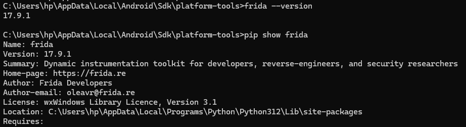
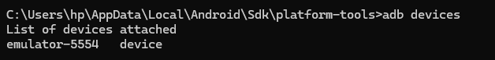
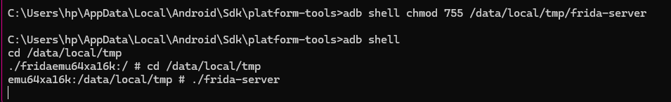
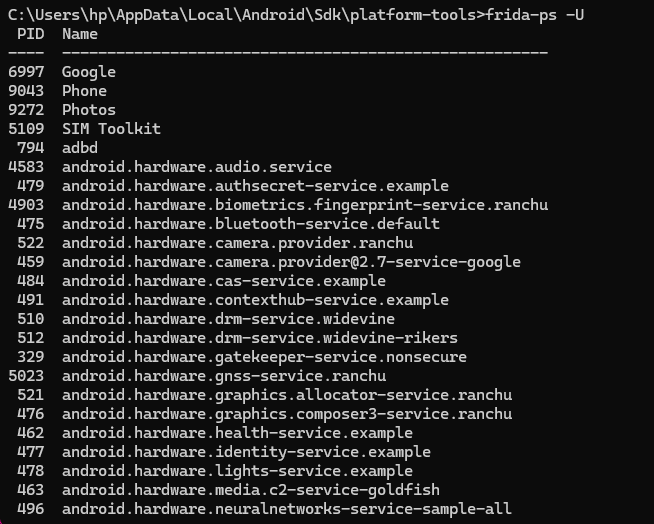
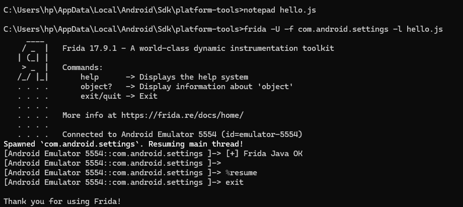
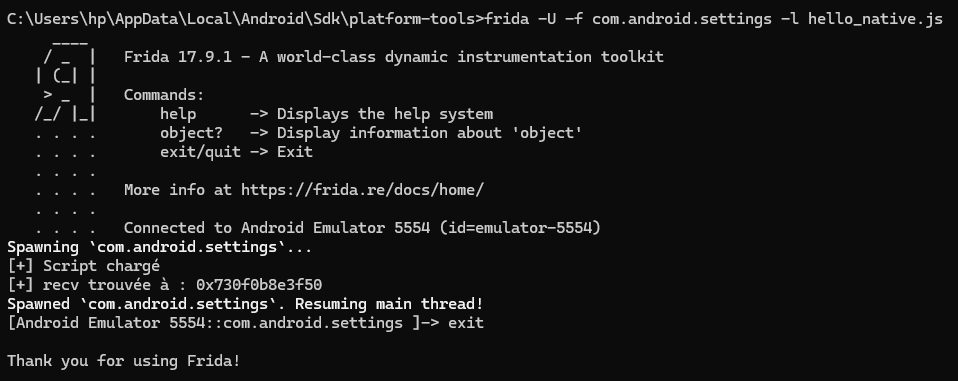
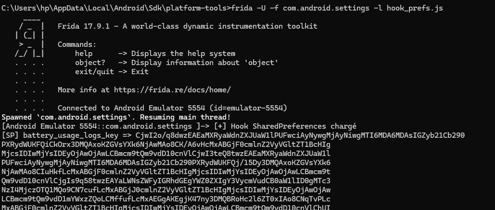

# Lab Frida – Guide d'installation de Frida

##  Introduction

Dans ce lab, j’ai utilisé Frida pour faire de l’analyse dynamique sur une application Android.  
L’objectif était de comprendre comment observer le comportement d’une application en temps réel, sans modifier son code source.
J’ai travaillé avec un émulateur Android (Android Studio) et j’ai utilisé CMD pour toutes les commandes.

## Installation de Frida
J’ai installé Frida avec pip :
pip install frida frida-tools
Ensuite, j’ai vérifié que tout est bien installé avec :
frida --version  

## Connexion avec l’émulateur Android
J’ai utilisé ADB pour connecter mon émulateur :
adb devices
L’émulateur est bien détecté avec l’état "device".

## Installation de frida-server

J’ai récupéré la version de frida-server compatible avec l’architecture de l’émulateur (x86_64).
Ensuite, j’ai fait :
adb push frida-server /data/local/tmp/  
adb shell chmod 755 /data/local/tmp/frida-server  
Puis j’ai lancé le serveur :
adb shell /data/local/tmp/frida-server

## Test de connexion
Pour vérifier que Frida fonctionne avec l’émulateur :
frida-ps -U
Cette commande affiche la liste des applications Android en cours d’exécution.

## Injection d’un script simple
J’ai créé un fichier hello.js :

Java.perform(function () {
  console.log("[+] Frida OK");
});

Puis j’ai exécuté :

frida -U -f com.android.settings -l hello.js
Résultat : le message s’affiche dans la console.

## Analyse réseau (hook natif)
J’ai utilisé un script pour intercepter les fonctions réseau comme :
- connect
- send
- recv
Cela permet d’observer quand l’application communique avec le réseau

## Analyse du stockage (SharedPreferences)
J’ai utilisé Frida pour observer les données internes de l’application (SharedPreferences).
Le script permet d’afficher les clés et valeurs utilisées.

